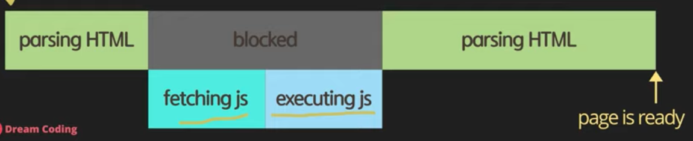
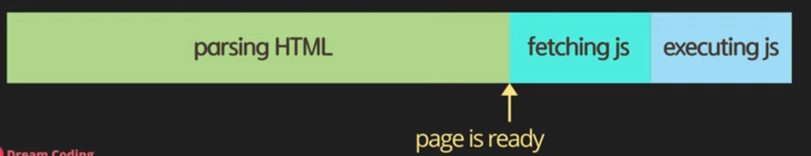
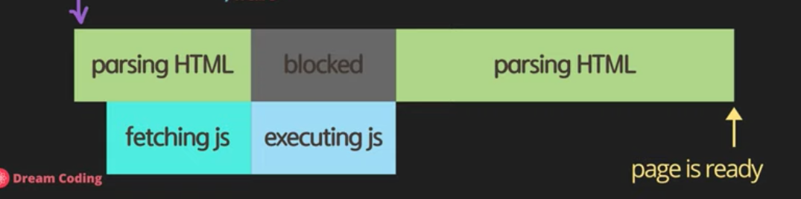
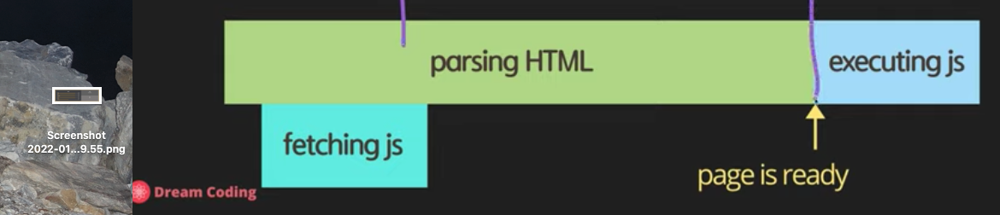
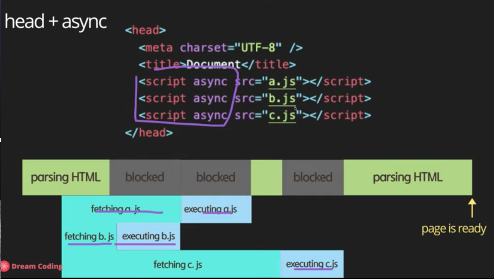
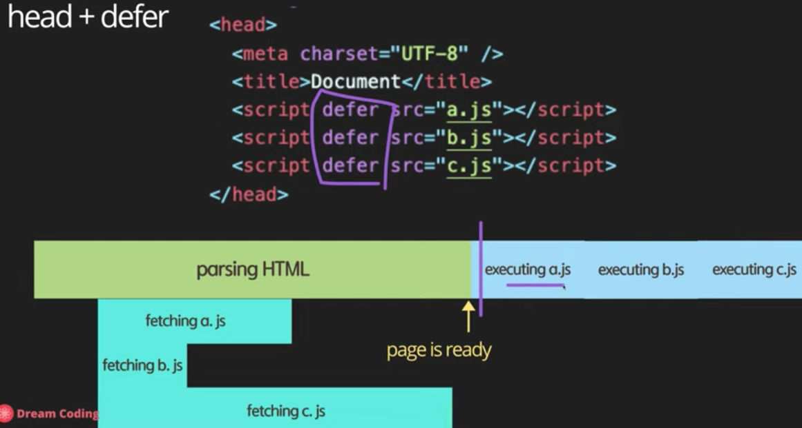

#### [Dreamcoding 자바스크립트 기초 강의]


# 1. 자바스크립트의 역사와 현재 그리고 미래
- 10일만에 만든 유연한 언어  
- 다른 언어 기준 비상식적인 일들이 가능함 ex) 선언되지 않은 변수 값 할당 가능   
<br>


# 2. 콘솔에 출력, script async 와 defer의 차이점

## 1) node.js
node js에는 js 엔진이 있어서 브라우저 없이 실행할 수 있다.   

## 2) Web API
Web API: 브라우저가 이해하는 함수들  
여러 web API 중 console API가 있고 그중 한 함수가 log 

## 3) async VS defer
영상 좋음 https://www.youtube.com/watch?v=tJieVCgGzhs&list=PLv2d7VI9OotTVOL4QmPfvJWPJvkmv6h-2&index=2  
a. head 안   
  - 브러우저가 한줄한줄 파싱해서 돔으로 변환   
    
b. body 끝  
  - html 가져오고 난 다음에 fetching js   
  - js 의존적일 경우 fetching 기다려야 함   
     
c. asyn  
  - parsing 하다가 병렬적으로   
   
d. defer  
    
  
   
   
  
## 4) 'use strict';
- ES5에서 시작    
- 유연함에서 생기는 비상식적인 일 불가능하도록 막음 ex) 선언되지 않은 변수 값 할당 가능   
  <br>
  
  
# 3. data types, let vs var, hoisting

## 1) variable VS constant
### 1-1) variable
#### a. 기본
- **rw**   
- **mutable: 변수가 메모리 어딘가 할당된 박스를 가르키기에, 포인터를 이용해 지칭하는 값을 계속 바꿀 수 있다.**
```
let name = 'yoon'; 가리키는 것이 만들어짐
console.log(name);
name = 'cho'; 가리키는 대상은 달라질 수 있음
console.log(name);
```
#### b. global/ local
- block scope에 들어가있는지 여부에 따라
#### c. let과 비교하는 var
- es5 이전   
- 선언 이전에도 할당/출력이 가능했음   
- *var hoisting*: 어디 선언했는지 상관 없이 선언을 제일 위로 올림   
- black scope이 없다, 즉 아무 곳에서나 사용 가능    
### 1-2) constant
#### a. 기본
- **r**   
- **immutable: 값을 가리키는 포인터가 잠겨있어서, 할당 이후 값 변경 불가능**   
#### b. 장점 세 가지
- security   
- thread safety: thread들이 동시에 작동할 때 값을 변경하는 것을 막기 위해서   
- reduce human mistakes
### 1-3) 정리   
- Immutable data types: premitive types, frozen objects(i.e. object.freeze())
- Mutable data types: all objects by default are mutable in JS 

## 2) Variable types
어떤 언어든 아래 두 가지로 나뉘어진다.   
- a. primitive   
  - single item: 더이상 나눌 수 없는 단위   
  - number, string, boolean, null, undefined, symbol   
  - 메모리에 값 저장되는 방식: value 자체가 메모리에 저장됨   
- b. object   
  - box container: single item을 여러개 묶어서 한 박스로 관리함    
  - 메모리에 값 저장되는 방식: 크기에 한번에 메모리에 저장되지 못함. object를 가리키는 레퍼런스가 저장됨.   
- c. function   
  - first-class function: JS에서는 function도 변수에 할당이 가능하고, 또 그렇기에 함수 인자, ruturn타입으로 return할 수 있다.   
### 2-1) number   
C, Java와 달리 number만 있음. 심지어 number이라고 타입 선언하지 않아도 괜찮다.   
const count = 17; // integer => type:number   
const size = 17.1; // decimal number  => type:number   
### 2-2) number - speicla numeric values: infinity, -infinity, NaN
const infinity = 1 / 0;    
const negativeInfinity = -1 / 0;   
const nAn = 'not a number' / 2;   
* 값이 정말 valid한 값인지 확인하지 않으면 오류가 생길 수 있다.    
### 2-3) string
const char = 'c';   
const brendan = 'brendan';   
const greeting = 'hello ' + brendan; // value: hello brendon => type:string    
### 2-4) boolean
- false: 0, null, undefined, NaN, ''   
- true: any other value   
const canRead = true; // => value: ture/ type: boolean   
const test = 3 < 1; // => value: false/ type:boolean   
### 2-5) null
null이라고 할당, 즉 empty값이라고 지정   
let nothing = null; // => value: null, type: object   
### 2-6) undefined
선언은 되었지만 값은 지정하지 않았음   
let x; // => value: undefined, type: object undefined   
### 2-7) symbol, create unique identifiers for object
고유한 식별자가 필요할 때   
- map 등 자료구조에서   
- 동시다발적으로 일어나는 코드에서 우선순위를 설정해야 할 때   
const symbol1 = Symbol('id');   
const symbol2 = Symbol('id');   
  console.log(symbol1 === symbol2);// false   
const gSymbol1 = Symbol.for('id');   
const gSymbol2 = Symbol.for('id');   
  console.log(gSymbol1 === gSymbol2); // true   
- symbol 출력시: '.description' 이용하여 string으로 변환하지 않으면 출력시 오류   
console.log(`value: ${symbol1.description}, type: ${typeof symbol1}`); //  => value: id, type: symbol

## 3) object, real-life object, data structure
const ellie = { name: 'ellie', age: 20 };   
ellie.age = 21;   

## 4) Dynamic typing: dynamically typed language
let text = 'hello'; // => type: string   
text = 1; // => type: number   
text = '7' + 5; // => valueu: 75, type: string   
text = '8' / '2'; => valueu: 4, type: number   
- 이런 식으로 혼동이 생겨서 type을 지정하는 것이 typescript   
<br>


# 4. operator

## 1) String concatenation 
console.log('my' + ' cat');   
console.log('1' + 2);   
console.log(`string literals: 1 + 2 = ${1 + 2}`);   

## 2) Numeric operators
console.log(1 + 1); // add   
console.log(1 - 1); // substract   
console.log(1 / 1); // divide   
console.log(1 * 1); // multiply   
console.log(5 % 2); // remainder   
console.log(2 ** 3); // exponentiation   

## 3) Increment and decrement operators
let counter = 2;   
- const preIncrement = ++counter;   
// counter = counter + 1; //3   
// preIncrement = counter; // 3   
- const postIncrement = counter++;   
// postIncrement = counter; //3      
// counter = counter + 1; //4      

## 4) Assignment operators
let x = 3;   
let y = 6;   
x += y; // x = x + y;   

## 5) Comparison operators
console.log(10 < 6); // less than   
console.log(10 <= 6); // less than or equal   
console.log(10 > 6); // greater than   
console.log(10 >= 6); // greater than or equal   

## 6) Logical operators: || (or), && (and), ! (not)
```
const value1 = true (혹은 false);
const value2 = 4 < 2;
function check() {
  for (let i = 0; i < 10; i++) {
    //wasting time
    console.log('😱');
  }
  return true;
}
```
#### || (or), finds the first truthy value
console.log(`or: ${value1 || value2 || check()}`);   
- 아래 and도 마찬가지이지만, 코드 작성시 과정이 가장 무거운 것을 마지막에 놓는 것이 좋은 코드   
#### && (and), finds the first falsy value
console.log(`and: ${value1 && value2 && check()}`);   
- often used to compress long if-statement    
- nullableObject && nullableObject.something   
#### ! (not)
console.log(!value1);   

## 7 ) Equality
```
const stringFive = '5';
const numberFive = 5;
```
#### == loose equality, with type conversion
console.log(stringFive == numberFive); // true   
console.log(stringFive != numberFive); // false   
#### === strict equality, no type conversion
console.log(stringFive === numberFive); // false   
console.log(stringFive !== numberFive); // true   
###  # object equality by reference
```
const ellie1 = { name: 'ellie' };
const ellie2 = { name: 'ellie' };
const ellie3 = ellie1;
```
console.log(ellie1 == ellie2); // false, 다른 레퍼런스가 저장되어 있음   
console.log(ellie1 === ellie2); // false, 레퍼런스 값도 다름   
console.log(ellie1 === ellie3); // true   
// equality - puzzler
console.log(0 == false); // true   
console.log(0 === false); // false, 0 bolean 아니어서   
console.log('' == false); // true   
console.log('' === false); // false, '' bolean 아니어서   
console.log(null == undefined); // true   
console.log(null === undefined); // false   

## 8) Conditional operators: if
```
const name = 'df';   
if (name === 'ellie') {   
  console.log('Welcome, Ellie!');   
} else if (name === 'coder') {   
  console.log('You are amazing coder');   
} else {   
  console.log('unkwnon');   
}  
```

## 9) Ternary operator: ?
- if를 간단하게   
- condition ? value1 : value2;   
console.log(name === 'ellie' ? 'yes' : 'no');   

## 10) Switch statement
- use for multiple if checks    
- use for enum-like value check   
- use for multiple type checks in TS   
```
const browser = 'IE';
switch (browser) {
  case 'IE':
    console.log('go away!');
    break;
  case 'Chrome':
  case 'Firefox':
    console.log('love you!');
    break;
  default:
    console.log('same all!');
    break;
}
```
<br>


# 5. loops

## 1) while
- 조건문이 맞을 때만 실행하고 싶다면   
- while loop, while the condition is truthy,   
- body code is executed.   
```
let i = 3;
while (i > 0) {
  console.log(`while: ${i}`);
  i--;
}
```
## 2) do while
-  block 먼저 실행하고 싶다면    
-  do while loop, body code is executed first,   
-  then check the condition.   
```
do {
  console.log(`do while: ${i}`);
  i--;
} while (i > 0);
```

## 3) for loop
- for(begin; condition; step)   
```
for (i = 3; i > 0; i--) {
  console.log(`for: ${i}`);
}
```
```
for (let i = 3; i > 0; i = i - 2) {
  // inline variable declaration
  console.log(`inline variable for: ${i}`);
}
```

## 4) nested loops
```
for (let i = 0; i < 10; i++) {
  for (let j = 0; j < 10; j++) {
    console.log(`i: ${i}, j:${j}`);
  }
}
``` 

## 5) break, continue
- break: loop 완전히 끝냄   
- continue: 지금 것만 건너뜀   
<br>


# 6. function
## 1) 기본
- fundamental building block in the program   
- subprogram can be used multiple times   
- performs a task or calculates a value   

## 2) Function declaration
- function name(param1, param2) { body... return; }   
- **one function === one thing**   
- naming: doSomething, command, verb   
- e.g. createCardAndPoint -> createCard, createPoint   
- **function is object in JS** 즉, 변수에 할당할 수 있고, 파라미터로 전달도 되고, return도 가능
```
function printHello() {
  console.log('Hello');
}
printHello();
// => 파라미터로 메세지 전달
function log(message) {
  console.log(message);
}
log('Hello@');
log(1234);
```
## 3) Parameters
- primitive parameters: passed by value   
- object parameters: passed by reference   
```
function changeName(obj) {
  obj.name = 'coder';
}
const ellie = { name: 'ellie' };
changeName(ellie);
console.log(ellie);
```

## 4) Default parameters (added in ES6)
```
function showMessage(message, from = 'unknown') {
  console.log(`${message} by ${from}`);
}
showMessage('Hi!');
```

## 5) Rest parameters (added in ES6)
- 배열 형태로 저장됨   
```
function printAll(...args) {
  //배열 출력 방법_1
  for (let i = 0; i < args.length; i++) {
    console.log(args[i]);
  }
  //배열 출력 방법_2
  for (const arg of args) {
    console.log(arg);
  }
  //배열 출력 방법_3
  args.forEach((arg) => console.log(arg));
}
printAll('dream', 'coding', 'ellie');
```

## 6) Local scope
- 밖에서는 안이 보이지 않고,안에서만 밖을 볼 수 있다.   

## 7) Return a value
```
function sum(a, b) {
  return a + b;
}
```

## 8) [현업팁] Early return, early exit
```
// bad
function upgradeUser(user) {
  if (user.point > 10) {
    // long upgrade logic...
  }
}
// good
function upgradeUser(user) {
  if (user.point <= 10) {
    return;
  }
  // long upgrade logic...
}
```
<br>


# 7.  함수 추가 (Function expression, Arrow function 등)

## 1) First-class function
- functions are treated like any other variable   
- can be assigned as a value to variable    
- can be passed as an argument to other functions.   
- can be returned by another function   
- 이걸 가능하게 하는 것이 Function expression

## 2) Function expression
- a function declaration can be called earlier than it is defined. (hoisted)   
- a function expression is created when the execution reaches it.
``` 
const print = function () { // anonymous function: 이름 없이 필요한 부분만 작성해서 변수에 할당할 수 있다. cf) named function
  console.log('print');
};
print();
const printAgain = print;
printAgain();
const sumAgain = sum;
console.log(sumAgain(1, 3));
```

## 3) Callback function using function expression
```
function randomQuiz(answer, printYes, printNo) {
  if (answer === 'love you') {
    printYes();
  } else {
    printNo();
  }
}
// a. anonymous function
const printYes = function () {
  console.log('yes!');
};
// b. named function
// - better debugging in debugger's stack traces
// - recursions
const printNo = function print() {
  console.log('no!');
};
randomQuiz('wrong', printYes, printNo);
randomQuiz('love you', printYes, printNo);
```

## 4) Arrow function
- always anonymous   
// const simplePrint = function () {
//   console.log('simplePrint!');
// };
const simplePrint = () => console.log('simplePrint!');
const add = (a, b) => a + b;
const simpleMultiply = (a, b) => {
  // do something more
  return a * b;
};

## 5) IIFE: Immediately Invoked Function Expression
- 선언과 동시에 호출 
(function hello() {
  console.log('IIFE');
})();
<br>


# 8.  _class_ vs object

## 1) 기본
- Object-oriendted programming  
- class: template   
- object: instance of a class  
- JavaScript classes   
  - introduced in ES6   
  - syntactical sugar over prototype-based inheritance   

## 2) Class declarations
```
class Person {
  // constructor
  constructor(name, age) {
    // fields
    this.name = name;
    this.age = age;
  }
  // methods
  speak() {
    console.log(`${this.name}: hello!`);
  }
}
//new: 새로운 object 만들 때
const ellie = new Person('ellie', 20);
console.log(ellie.name);
console.log(ellie.age);
ellie.speak(); 
```

## 3) Getter and setters: keyword
- 잘못된 파라미터 값이 입력되는 문제를 방지하기 위해   
- age getter를 정의하는 순간: this.age는 메모리에 올라가있는 데이터를 읽어오는 것이 아니라, getter를 호출하게 된다.   
- age setter를 정의하는 순간: 값을 할당할 때(this.age = age;), 메모리에 올라가있는 값을 할당하는 것이 아니라, setter를 호출하게 된다.     
- 다른 말로, setter 안에서 전달된 value를 this.age에 할당할 때 메모리의 값을 업데이트하는 것이 아니라, setter를 호출하게 된다. 즉, setter가 setter를 호출하는 일이 무한정 반복.   
```
class User { 
  constructor(firstName, lastName, age) {
    this.firstName = firstName;
    this.lastName = lastName;
    this.age = age;
  }

  get age() {
    return this._age;
  //return this.age;
  }

  set age(value) {
    // if (value < 0) {
    //   throw Error('age can not be negative');
    // }
    this._age = value < 0 ? 0 : value;
  //this.age = value
  }
}
const user1 = new User('Steve', 'Job', -1);
console.log(user1.age);
``` 

## 4) Fields (public, private)
- Too soon! (https://developer.mozilla.org/en-US/docs/Web/JavaScript/Reference/Classes/Class_fields)   
```
class Experiment {
  publicField = 2;
  #privateField = 0;
}
const experiment = new Experiment();
console.log(experiment.publicField);
console.log(experiment.privateField);
```

## 5) Static properties and methods
- Too soon!   
``` 
class Article {
  static publisher = 'Dream Coding';
  constructor(articleNumber) {
    this.articleNumber = articleNumber;
  }

  static printPublisher() {
    console.log(Article.publisher);
  }
}
const article1 = new Article(1);
const article2 = new Article(2);
console.log(Article.publisher);
Article.printPublisher();
``` 

## 6) Inheritance
- a way for one class to extend another class.    
```
class Shape {
  constructor(width, height, color) {
    this.width = width;
    this.height = height;
    this.color = color;
  }

  draw() {
    console.log(`drawing ${this.color} color!`);
  }

  getArea() {
    return this.width * this.height;
  }
}

class Rectangle extends Shape {}
class Triangle extends Shape {
  // 필요한 함수만 overwritting(재정의) 가능
  //  super 사용시 기존 method도 사용 가능
  draw() {
    super.draw();
    console.log('🔺');
  }
  getArea() {
    return (this.width * this.height) / 2;
  }
}
```

## 7) Class checking: instanceOf
- 전자가 후자의 instance인가를   
- boolean으로 판별   
```
console.log(rectangle instanceof Rectangle);
console.log(triangle instanceof Rectangle);
console.log(triangle instanceof Triangle);
console.log(triangle instanceof Shape);
console.log(triangle instanceof Object); // JS에서 만든 모든 object class를 JS object를 상속한 것
console.log(triangle.toString()); // 그래서 이런 것도 가능함  
```
<br>


# 9.  class vs _object_

## 1) 기본
- one of the JavaScript's data types.    
- a collection of related data and/or functionality.   
- Nearly all objects in JavaScript are instances of Object   

## 2) 문법 및 생성
**object = { key : value }; **   
const obj1 = {}; // a. 'object literal' syntax   
const obj2 = new Object(); // b. 'object constructor' syntax   

## 3) with JavaScript magic (dynamically typed language)
- can add properties later   
ellie.hasJob = true;   
- can delete properties later     
delete ellie.hasJob;   

## 4) Computed properties
- key should be always string   
```
console.log(ellie.name); // key에 해당하는 것을 받아오고 싶을 때
console.log(ellie['name']); // 어떤 것을 받아오는지 모를 때, 즉 실시간으로 원하는 키의 값을 받아오고 싶을 때 - 아래 예시
ellie['hasJob'] = true;
console.log(ellie.hasJob);

function printValue(obj, key) {
  console.log(obj[key]);
}
printValue(ellie, 'name');
printValue(ellie, 'age');
```

## 5) Property value shorthand
```
const person1 = { name: 'bob', age: 2 };
const person2 = { name: 'steve', age: 3 };
const person3 = { name: 'dave', age: 4 };
const person4 = new Person('elile', 30);
// const person4 = makePerson('elile', 30);
```

## 6) Constructor Function
- 순수하게 object를 생성하는 함수  
```
function Person(name, age) {
  // this = {}; 생략
  this.name = name;
  this.age = age;
  // return this; 생략
}
```
- 클래스가 없었을 때는 아래처럼 함수를 만들었음   
```
function makePerson(name, age) {
  return {
    name,
    age,
  },
}
```

## 7) in operator: property existence check (key in obj)
```
console.log('name' in ellie);
console.log('age' in ellie);
console.log('random' in ellie); // false
console.log(ellie.random); // undefined
```

## 8) for..in vs for..of
### a. for (key in obj)
```
for (key in ellie) {
  console.log(key);
}
```
### b. for (value of iterable)
```
const array = [1, 2, 4, 5];
for (value of array) {
  console.log(value);
}
```

## 9) Fun cloning
- 아래 방법은 복사가 아니라 동일한 object   
```
const user = { name: 'ellie', age: '20' };
const user2 = user;
user2.name = 'coder';
console.log(user); // coder
```
- 복사는 어떻게 하나?   
-  old way   
```
const user3 = {};
for (let key in user) {
  user3[key] = user[key];
}
console.log(user3);
```
- Object.assign(dest, [obj1, obj2, obj3...])   
- Object: JS 기본 object 중 하나   
```
const user4 = Object.assign({} , user);
console.log(user4);
```
```
// another example
const fruit1 = { color: 'red' };
const fruit2 = { color: 'blue', size: 'big' };
const mixed = Object.assign({}, fruit1, fruit2);
console.log(mixed.color); // blue
console.log(mixed.size);
``` 
<br>


# 10.  array

## 1) Declaration
```
const arr1 = new Array();
const arr2 = [1, 2];
```

## 2) Index position
```
const fruits = ['🍎', '🍌'];
console.log(fruits);
console.log(fruits.length);
console.log(fruits[0]);
console.log(fruits[1]);
console.log(fruits[2]); // undefined
```
## 3) Looping over an array
### a. for
```
for (let i = 0; i < fruits.length; i++) {
  console.log(fruits[i]);
}
```
### b. for of
```
for (let fruit of fruits) {
  console.log(fruit);
}
```
### c. forEach
- API  
- callback function 받아옴   
```
fruits.forEach((fruit) => console.log(fruit)); 
// fruits.forEach(function (fruit, index, array) {  // forEach에 function 전달, 인자 3개를 받을 수 있음
//   console.log(fruit, index, array);
// });
```

## 4) Addtion, deletion, copy
### a. push: add an item to the end
```
fruits.push('🍓', '🍑');
```
### b. pop: remove an item from the end
```
fruits.pop();
```
### c. unshift: add an item to the benigging
```
fruits.unshift('🍓', '🍋');
```
### d. shift: remove an item from the benigging
```
fruits.shift();
```
- note!! shift, unshift are slower than pop, push   
### e. splice: remove an item by index position
```
fruits.splice(1); // 개수 지정 안하면 시작부터 다 지움
fruits.splice(1, 1); 
fruits.splice(1, 1, '🍏', '🍉'); // 지운 자리에 데이터 추가
```
### f. combine two arrays
```
const fruits2 = ['🍐', '🥥'];
const newFruits = fruits.concat(fruits2);
```

## 5) Searching
### a. indexOf: find the index   
```
console.log(fruits.indexOf('🍎'));
console.log(fruits.indexOf('🍉'));
console.log(fruits.indexOf('🥥')); // undefined
```
### b. includes:  
```
console.log(fruits.includes('🍉')); // ture
console.log(fruits.includes('🥥')); // false
```
### c. lastIndexOf
```
console.log(fruits.indexOf('🍎')); // 제일 처음 인덱스
console.log(fruits.lastIndexOf('🍎'));
```
