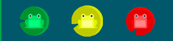
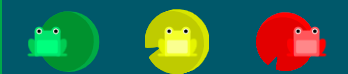

자료 출처: 드림코딩 유튜브

# 1. HTML

## 1) 태그는 두 가지로 구분 가능
- a. box: sectionig을 도와줌
- b. item  


article: 반복되는 것을 묶어줌

## 2) Tag & Element & Attribute

element, 다른 말로 node라고도 한다.

  
## 3) Black & Inline
block ex.div
inline ex.span

## 4) Input & Type


# 2. CSS

## 1) 의미, 정의
Cascading Style Sheet
정의된 세부 사항이 있다면 그것을 쓰고, 없다면 기본 지정된 것으로 넘어간다.  
- Author style
- User style
- Browser
[nomadcoder] 브라우저가 CSS를 읽을 때 위에서부터 순서대로 읽는다.  
CSS를 직접 적는 것을 inline CSS, CSS 파일을 include 하는 것을 external CSS라고 한다. 만약 같은 selector를 가리키는 CSS가 여러개이면, 가장 마지막 스타일이 적용된다.  

## 2) Selector
- universal *
- type Tag
- ID #id
- class .class
- state :
  - active, hover, focus, visited, focus-within(부모 요소에게 적용. 자신의 자식 요소 중 하나가 focused되었을 때 효과를 적용)
- attribute []
```
# state :
button:hover {
  color:red;
}
# attribute []
a[href] {
  color:green;
}
# attribute [] 세부적으로
a[href="naver.com] {
  color:green;
}
```

###  Pseudo Selectors (다양한 연습 https://flukeout.github.io/)
- A  B/ #id  A  
  - Descendant Selector: Select an element inside another element  
  - Selects all B inside of A. B is called a descendant because it is inside of another element.  
- A  *
- A + B: This selects all B elements that *directly* follow A.
- A ~ B: A ~ B selects all B that follow a A
- A > B: selects all B that are a direct children A
- :first-child: selects all first child elements  
  - p:first-child
  - div p:first-child
- :only-child: You can select any element that is the only element inside of another one.   
  - ex) plate pickle:only-child
  - 벤토 위, 접시 위에 각각 하나 씩 피클이 있을 때, 접시 위에 있는 피클만 고르고 싶을 경우
- :nth-child(A)/ nth-last-child(A)
- :nth-of-type(2)/(odd)/(even)/(2n+3)
- :first-of-type

## 3) 레이아웃 : dispay & position

### 3-1) display
##### a. block
  - 한 줄  
  - [nomadcoder] box임  
    -  옆에 아무것도 올 수 없다.  
    -  margin, padding, border 있음 
  - ex.div  
##### b. inline 
  - 컨텐츠를 꾸며준다    
  - ex.span(: 짧은 글귀)  
  - [nomadcoder] box 아님
    - margin(좌우만), padding, border 있음  
    - width, height 없다. 그래서 위, 아래에 margin을 가질 수 없다.    
    - 이와 같은 상황에 margin을 위, 아래에 적용하고 싶다면, inline 요소를 block으로 바꿔줘야 한다.  
##### c. inline-block  
  - 한 줄에 여러개 넣는데, 상자로 변환된다. 즉, 컨텐츠 크기에 상관 없이 지정한 width, height 등에 맞추어서  
  - [nomadcoder] block으로 인식하게 한다.  
    - width, height 가질 수 있고, 그래서 사방 margin을 가질 수 있다. 
    - 동시에 inline이어서 바로 옆에 다른 요소가 올 수도 있다.  
    - 문제점 많음 (간격 있고, 정해진 형식 없다.): 창 크기가 달라지면 박스 크기 달라질 수 있다. 
    - - **=> flex**

#####  *[nomadcoders] Collapsing margin*  
  - 상하에서만 발생함  
  - child box 경계가 parent box 경계와 같을 때 발생
  - 두 box의 margin이 하나가 된다, 큰 margin으로 통일됨.
  - **=> padding**

## 3-2) position 
##### a. static
  - 디폴트값          
##### b. relative
  - <strike>원래 있어야 하는 아이템에서 옮겨간 것</strike>   
  - [nomadcoders] 가장 가까운 relative 부모를 기준으로 이동. position:relative; 를 해주면 부모가 된다. 없으면 body.  
##### c. absolute
  - 내가 담겨있는 상자 안에서 움직인 것     
##### d. fixed
  - 상자가 아니라, 페이지(윈도우) 상에서 옮겨간 것     
  - [nomadcoders] 레이어를 부수고 제일 위에 있는 새로운 레이어가 생겨서 거기 위치하게 된다. 
  - vh 크게 해서 스크롤 해도 따라오는 메뉴바에서 쓰임
##### e. sticky 
  - 원래 자리에 있으면서 스크롤링해도 그 자리 유지   
  

[nomadcoders]   
- 사용 용도: 레이아웃 차원이 아니라, 위치를 조금 옮기고 싶을 때 사용

## 4) Flexbox: container & item
### 4-1) main/cross axis
### 4-2) container
- display: flex;    
- flex-flow: column wrap;  
  - flex-direction: row/column-reverse;  
  - 
  - flex-wrap: nowrap/wrap-reverse;  
    - [nomadcoders]  wrap 적용 안할 경우 자식 크기가 화면 사이즈에 따라 유동적으로 변화되나, 적용하면 initial 크기 유지  
- justify-content:  
  - *main axis*
  -  flex-start/felx-end/center/**space-around/space-between/space-evenly**;   
  - 
  - 
  - 
- align-items:  
  - *cross axis - flex line을 기준으로 아이템 정렬*   
  - flex-start/felx-end/center/**baseline**;  
  - baseline: 텍스트가 균등하게 보이도록  
  - 
- align-content:  
  - *cross axis - flex line을 정렬*  
  - flex-start/felx-end/center/**space-around/space-between**;  
  - align-content는 corss axis에 대한 justify-content라 이해할 수 있습니다.   
  - align-content는 여러 줄들 사이의 간격을 지정하며, align-items는 컨테이너 안에서 어떻게 모든 요소들이 정렬하는지를 지정합니다. 한 줄만 있는 경우, align-content는 효과를 보이지 않습니다.    

### 4-3) item
- flex: *grow, shrink, basis*  
  - flex-grow/shrink  
  - flex-basis: auto/30%;  
- align-self: center;  
  - item별로 아이템 정렬  

[nomadcoders] flex rules  
**1. 자식이 아니라 부모에게 명시한다**  
  - div의 부모를 display:flex로 만든다
  - 부모에 display: flex를 명시해야, 부모 자식 관계가 생김 ex. font-size 부모에 명시해서 자식에 적용 가능  
**2. main axis & cross axis**
  - justify-content는 main axis를 따라 움직임  
  - align-items는 cross axis를 따라 움직임

  

## 5) Responxive Web

### 5-1) 문법
  ```
  @media screen/speech/print/all and/not/only/, (min-width: 800px){
    .container {
      width: 50%;
    }
  }
  ```
  
### 5-2) absolute VS relative
- absolute: px
- relative: % v* em rem

### 5-3) 기준에 따른 사용
#### a. parent VS browser
  - parent: %, em
  - browser: v*, rem
#### b. box VS font
  - box: %, v*
  - font: re, rem

### 5-4) em VS rem
  - em: relative to parent element (font-size)
    ```
    ex.
    .parent {
      font-size: 8em;   # 디폴트 값 16px * 8 = 128px
    }
    .child {
      font-size: 0.5em;   # 128px * 0.5 = 64px
    }
    ```
  - rem: relative to root element (font-size)

 ```
 # 사례
        h1 {
            font-size: 1.75rem;
            color: palevioletred;
            margin: auto;
            text-align: center;  /* !!! */
        }
        .container {
            display: flex;
            padding: 2em; /*32px*/
        }
        /* uncalled properties at @media follow above normal properties */
        @media screen and (max-width: 768px) {
            .container {
                flex-direction: column;
            }
        }
        .component {
            border: 1px solid palevioletred;
            margin: 1em  /*16px: font-size 기준이기에*/
        }
        .title {
            font-size: 1.5rem;
            padding: 1em;
            background-color: palevioletred;
        }
        .contents {
            font-size: 1.125rem;
            padding: 1em;
        }
```
 

## 6) useful tips
- Q) 덕분에 반응형에 대한 개념을 좀 더 알아갈 수 있었습니다! 혹시 padding, margin, font 등 크기를 설정할 때 어떤 기준이 있으신가요? 임의적으로  적당한 사이즈를 넣는 것인지 아니면 컨벤션이 따로 있는 것인지 알고 싶습니다. 아니면 디자이너와 협업할 때 시안대로 사이즈를 작성하시나요 ?  
- A) 현업에서는 디자이너가 제공해준 시안에 지정된 값을 사용하구요.
개인 프로젝트를 이용할때는 제가 적당한 사이즈를 넣는데, 그냥 아무 숫자나 넣는건 아니구 저는 Material Design Guidelines를 따라 가고 있어요.
예를 들어 스페이싱을 줄때 4배수로 넣고 (4, 8, 12, 16..) 그리고 간격은 최소 16dp가 좋고 버튼은 최소 32dp (아, 48dp 였나? 기억이 가물) 쓰고. 
딱히 이런 숫자를 따라하야 하는건 아니구요 :) 사용자가 쓸때 편리한지, 마우스로 쓸때 괜찮은지, 터치디바이스 (폰, 태블릿)에서 손가락으로 눌렀을때 적당한 크기 인지를 보고 일정한 값을 프로젝트에서 쓰는게 중요해요 🤗 
머테리얼 디자인에 대해 더 공부해 보고 싶으시다면: https://material.io/design/layout/understanding-layout.html#usage  


  

# 3.JavaScript  

### JS 기본 정리  
  - JS는 HTML을 제어하는 언어이다.  
  - 자바스크립트 코드가 와야 하는 속성 값이 존재한다 (ex. on-)  
  
## 이벤트  
  - 이벤트는 자바스크립트가 사용자와 상호작용하는 데 핵심적인 역할을 합니다.
  - *this*
       이벤트 안에서 실행되는 코드에서 현재 코드가 속해 있는 태그를 가리키도록 약속돼 있는 특수한 키워드  

## 문법
  #### 1) 변수와 대입연산자
  #### 2) 프로퍼티(properties) ex. .length
  #### 3) 함수  
  ##### a. 기본적인 분법  
          ```
          function sum(left, right) {
            document.wirte(legt + right + '<br>');
          }
          sum(2,3);
          ```
  ##### b. 매개변수 parameter: 인자를 받아서 함수 안으로 매개하는 변수
           ex. left, right
  ##### c. 인자 argument: 함수로 전달하는 값
           ex. 2, 3
  ##### d. return 키워드

## 객체  
### 기본
 여기서 정리할 객체의 특성: 정리 정돈의 수단으로써의 객체  
 함수와 변수가 많아지면 연관된 것들을 정리 정돈하는 도구  
  cf) 함수: 코드가 많아지면 정리 정돈하는 도구  
  ### 객체가 담을 수 있는 대상
  - 데이터: 문자열, 배열, 숫자 등
  - 함수도 담을 수 있다.
### 문법
  #### a. 객체 생성
  ```
  <script>
    // cats이라는 변수에 객체를 담는다. 
    var cats = {
        "우이동 고양이":"김석관",
        "중화동 고양이":"최까루"
     }
    </script>
  ```
  #### b. 객체와 반복 (feat. key(aka. index))
  ```
  <script>
    for(var key in cats) {
       document.write(key + ' : ' + cats[key] + '<br>');
    }
  </script>
  ```
  #### c. 객체 프로퍼티와 메서드(feat. this)
  - 메서드: 객체에 소속된 함수 ex. toUpperCase(), querySelectorAll()
  - 프로퍼티: 객체에 소속된 변수 ex. length
  ``` 
  // this 적용 전
  <script>
    // showAll()이라는 메서드 추가
    cats.showAll = function {
      for(var key in cats) {
         document.write(key + ' : ' + cats[key] + '<br>');
      }
    }
    cats.showAll();
  </script>
  ```
  ``` 
  // this 적용 후
  <script>
    // showAll()이라는 메서드 추가
    cats.showAll = function {
      for(var key in this) {
         document.write(key + ' : ' + this[key] + '<br>');
      }
    }
    cats.showAll();
  </script>
  ```
  ``` 
  // 객체 선언과 동시에 메서드 생성하는 법
var Body = {
  setColor: function (color) {
    document.querySelector('body').style.color = color;
   },
  setBackgroundColor: function (color) {
    document.querySelector('body').style.backgroundColor = color;
   }
}
  ```
 
# 4. etc

### 프로그래밍 언어
HTML, JS 둘 다 컴퓨터 언어이지만, HTML은 프로그래밍 언어가 아닙니다.  
프로그래밍 언어는 시간 순서에 따라 실행돼야 할 기능을 갖춘 문법으로 이루어진 컴퓨터 언어를 프로그래밍 언어라고 합니다. 
  
## refactoring
  - 코드의 가독성을 높이고  
  - 유지보수를 편리하게 만들고
  - 중복된 코드를 줄임
### a. this  
  : 이벤트 안에서 실행되는 코드에서 현재 코드가 속해 있는 태그를 가리키도록 약속돼 있는 특수한 키워드
### b. 변수
```
# this 적용 전
<input id="night_day" type="button" value="night" onclick="
  if(document.querySelector('#night_day').value=='night') {
    document.querySelector('body').style.backgroundColor = 'black';
    document.querySelector('body').style.color='white';
    document.querySelector('#night_day').value = 'day';
  } else {
    document.querySelector('body').style.backgroundColor = 'white';
    document.querySelector('body').style.color='black';
    document.querySelector('#night_day').value = 'night';
  }
">
  
# this 적용 후
<input type="button" value="night" onclick="
  if(this.value=='night') {
    document.querySelector('body').style.backgroundColor = 'black';
    document.querySelector('body').style.color='white';
    this.value = 'day';
  } else {
    document.querySelector('body').style.backgroundColor = 'white';
    document.querySelector('body').style.color='black';
    this.value = 'night';
  }
">
  
# 변수 적용 후 
<input type="button" value="night" onclick="
 var target = document.querySelector('body');                                          
  if(this.value=='night') {
    target.style.backgroundColor = 'black';
    target.style.color='white';
    this.value = 'day';
  } else {
    target.style.backgroundColor = 'white';
    target.style.color='black';
    this.value = 'night';
  }
">
```
  
  
