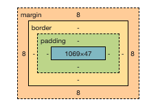

# 1. HTML

### Attribute 속성
src="Goya.jpg", width="50%"  
속성은 태그의 이름만으로는 정보가 부족할 때 사용됩니다.  


# 2. CSS

### CSS 삽입 방법 두 가지
a. <style> 태그  
b. style이라는 속성  
  - style이라는 속성을 쓰면 그 속성의 값을 웹 브라우저가 CSS 문법에 따라 해석해서 그 결과를 style 속성이 위치한 태그에 적용합니다.
  - style=""은 HTML의 속성
  - style이라는 속성은 값으로 반드시 CSS 효과가가 들어온다고 약속되어 있습니다. 
  
## CSS 문법
a{  
  color:red;  
}  
- "a": selector 선택자
- "color:red;": declaration 선언, 효과
- "color": property 속성
- "red": value 값

## selector
전제: 구체적일수록 우선 순위 높음, 반대로 추상적일수록(포괄적일수록) 우선 순위 낮음  
똑같은 형태의 선택자라면 맨 마지막에 등장하는 선택자가 우선순위가 높다 (CSS가 순서대로 작동하는가? 그렇다면 마지막이 앞선 코드 실행을 덮을 수 있어서 그러한가)
낮은 우선 순위대로
- 태그 선택자
- class 선택자(.)
- id 선택자(#)
  - id 값은 단 한번만 등장해야 한다(마치 학생 ID가 고유한 것처럼)  
* #gird ol 등 특정 선택 가능
  
## box
#### box model  
    
#### alignment 기본값 두 가지
  - block level alignment (ex. div)
  - inline alignment (ex. span)
  - display 속성 이용하여 변경 가능
  
## 캐싱 cache: CSS 파일 사용 이유
  cache: 저장한다라는 의미. css 파일을 한번 다운로드했다면, 웹 브라우저가 해당 파일을 컴퓨터에 저장한다. 따라서 네트워크 트래픽을 훨신 더 적게 쓸 수 있다. 
  

# 3.JavaScript  

### JS 기본 정리  
  - JS는 HTML을 제어하는 언어이다.  
  - 자바스크립트 코드가 와야 하는 속성 값이 존재한다 (ex. on-)  
  
## 이벤트  
  - 이벤트는 자바스크립트가 사용자와 상호작용하는 데 핵심적인 역할을 합니다.
  - *this*
       이벤트 안에서 실행되는 코드에서 현재 코드가 속해 있는 태그를 가리키도록 약속돼 있는 특수한 키워드  

## 문법
  #### 1) 변수와 대입연산자
  #### 2) 프로퍼티(properties) ex. .length
  #### 3) 메서드 ex. .toUpperCase()
  
 
# 4. etc

### 프로그래밍 언어
HTML, JS 둘 다 컴퓨터 언어이지만, HTML은 프로그래밍 언어가 아닙니다.  
프로그래밍 언어는 시간 순서에 따라 실행돼야 할 기능을 갖춘 문법으로 이루어진 컴퓨터 언어를 프로그래밍 언어라고 합니다. 
  
## refactoring
  - 코드의 가독성을 높이고  
  - 유지보수를 편리하게 만들고
  - 중복된 코드를 줄임
### a. this  
  : 이벤트 안에서 실행되는 코드에서 현재 코드가 속해 있는 태그를 가리키도록 약속돼 있는 특수한 키워드
### b. 변수
```
# this 적용 전
<input id="night_day" type="button" value="night" onclick="
  if(document.querySelector('#night_day').value=='night') {
    document.querySelector('body').style.backgroundColor = 'black';
    document.querySelector('body').style.color='white';
    document.querySelector('#night_day').value = 'day';
  } else {
    document.querySelector('body').style.backgroundColor = 'white';
    document.querySelector('body').style.color='black';
    document.querySelector('#night_day').value = 'night';
  }
">
  
# this 적용 후
<input type="button" value="night" onclick="
  if(this.value=='night') {
    document.querySelector('body').style.backgroundColor = 'black';
    document.querySelector('body').style.color='white';
    this.value = 'day';
  } else {
    document.querySelector('body').style.backgroundColor = 'white';
    document.querySelector('body').style.color='black';
    this.value = 'night';
  }
">
  
# 변수 적용 후 
<input type="button" value="night" onclick="
 var target = document.querySelector('body');                                          
  if(this.value=='night') {
    target.style.backgroundColor = 'black';
    target.style.color='white';
    this.value = 'day';
  } else {
    target.style.backgroundColor = 'white';
    target.style.color='black';
    this.value = 'night';
  }
">
```
  
  
